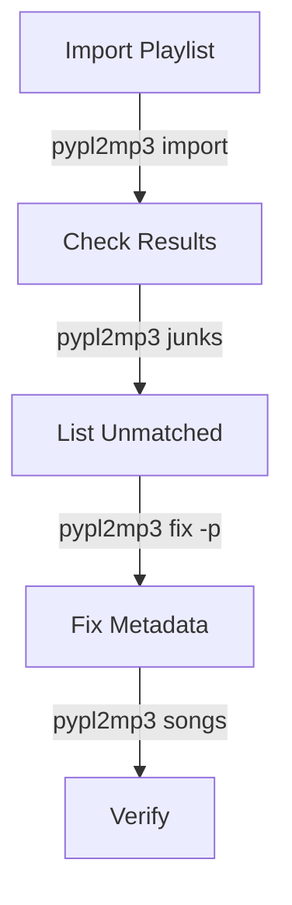
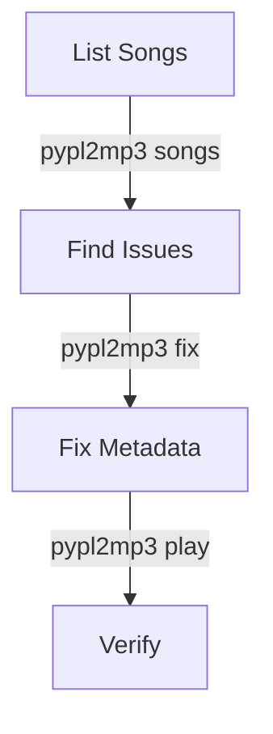

# Usage Examples

This document provides practical examples and common workflows for PYPL2MP3.

## Basic Operations

### 1. Import a YouTube Playlist
```sh
# Basic import
pypl2mp3 import "https://www.youtube.com/playlist?list=PLExample123"

# Import with high Shazam recognition threshold
pypl2mp3 import -t 70 "PLExample123"

# Import with confirmation prompt
pypl2mp3 import -p "PLExample123"
```

### 2. List Resources
```sh
# List all playlists
pypl2mp3 playlists

# List songs in a specific playlist
pypl2mp3 songs -l "PLExample123"

# List unmatched songs
pypl2mp3 junks
```

### 3. Play Music
```sh
# Play all songs
pypl2mp3 play

# Play specific playlist
pypl2mp3 play -l "PLExample123"

# Play with shuffle
pypl2mp3 play -s

# Play specific song
pypl2mp3 play "artist name" 1
```

## Advanced Usage

### 1. Metadata Management
```sh
# Fix unmatched songs
pypl2mp3 fix -l "PLExample123"

# Fix with interactive prompts
pypl2mp3 fix -p

# Remove metadata
pypl2mp3 junkize -l "PLExample123"
```

### 2. Search and Filter
```sh
# Search across all playlists
pypl2mp3 songs -f "hendrix jim"

# Search with lower match threshold
pypl2mp3 songs -f "hendrix" -m 25

# Filter during import
pypl2mp3 import -f "rock" "PLExample123"
```

### 3. Video Management
```sh
# Browse videos
pypl2mp3 videos

# Filter videos
pypl2mp3 videos -f "live"

# Browse specific playlist
pypl2mp3 videos -l "PLExample123"
```

## Common Workflows

### 1. Import and Clean Playlist


### 2. Music Management


## Feature Combinations

### 1. Import and Filter
```sh
# Import with filtering and high match threshold
pypl2mp3 import -f "rock" -t 75 -m 50 "PLExample123"
```

### 2. Search and Play
```sh
# Search and play specific genre
pypl2mp3 play -f "jazz" -s
```

### 3. Batch Operations
```sh
# Fix all unmatched songs across playlists
pypl2mp3 fix -t 60 -p
```

## Player Controls

```
Player Keyboard Controls:
[  <--  ] Previous song
[  -->  ] Next song
[ SPACE ] Pause/Play
[  TAB  ] Open video
[  ESC  ] Quit player
```

## Debug Examples

### 1. Basic Debugging
```sh
# Enable verbose errors
pypl2mp3 -d import "PLExample123"
```

### 2. Deep Debugging
```sh
# Full stack trace
pypl2mp3 -D import "PLExample123"
```

## Repository Management

### 1. Custom Location
```sh
# Use custom repository
pypl2mp3 -r "/custom/path" import "PLExample123"
```

### 2. Multiple Playlists
```sh
# Import multiple playlists
pypl2mp3 import "PLExample123"
pypl2mp3 import "PLExample456"
```

## Best Practices

1. **Importing New Playlists**
   - Start with default settings
   - Check unmatched songs
   - Fix metadata with prompts
   - Verify results

2. **Managing Existing Playlists**
   - Regular sync with source
   - Periodic metadata checks
   - Clean up unmatched songs

3. **Searching Content**
   - Use specific keywords
   - Adjust match threshold
   - Combine with filters

4. **Player Usage**
   - Create filtered playlists
   - Use shuffle for variety
   - Check video sources

## Common Patterns

### 1. Playlist Import
```sh
# Initial import
pypl2mp3 import -p "PLExample123"

# Check results
pypl2mp3 junks

# Fix issues
pypl2mp3 fix -p
```

### 2. Content Discovery
```sh
# Search content
pypl2mp3 songs -f "keyword"

# Play matches
pypl2mp3 play -f "keyword"

# Check videos
pypl2mp3 videos -f "keyword"
```

### 3. Maintenance
```sh
# List all playlists
pypl2mp3 playlists

# Check each playlist
pypl2mp3 songs -l "PLExample123"

# Fix metadata
pypl2mp3 fix -l "PLExample123"