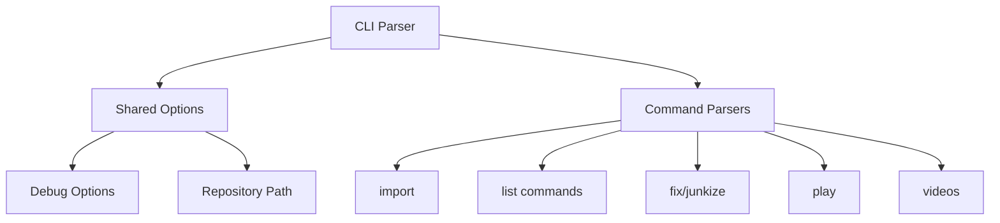

# Command Structure

This document details the command-line interface structure and implementation of PYPL2MP3.

## Command Architecture



## Global Options

All commands support these shared options:
- `-h, --help`: Show command help
- `-r, --repo <path>`: Set playlist repository
- `-d, --debug`: Enable verbose errors and logging
- `-D, --deep`: Enable deep debug with stack trace

## Command Implementations

### 1. Import Command
```
pypl2mp3 import [options] <playlist>
```

**Purpose**: Import/sync YouTube playlist to MP3 files

**Options**:
- `playlist`: ID/URL/INDEX (optional if default set)
- `-f, --filter <keywords>`: Filter songs
- `-m, --match <percent>`: Filter threshold (default: 45)
- `-t, --thresh <percent>`: Shazam threshold (default: 50)
- `-p, --prompt`: Confirm each import

**Implementation**: `_run_import_playlist()` (async)

### 2. List Commands

#### Playlists
```
pypl2mp3 playlists
```
**Purpose**: Display imported playlists
**Implementation**: `_run_list_playlists()`

#### Songs
```
pypl2mp3 songs [options]
```
**Options**:
- `-l, --list <playlist>`: Specific playlist
- `-f, --filter <keywords>`: Search filter
- `-m, --match <percent>`: Match threshold
- `-v, --verbose`: Detailed output

**Implementation**: `_run_list_songs()`

#### Junks
```
pypl2mp3 junks [options]
```
**Purpose**: List unmatched songs
**Implementation**: `_run_list_junks()`

### 3. Metadata Management

#### Fix Command
```
pypl2mp3 fix [options]
```
**Purpose**: Fix metadata for unmatched songs

**Options**:
- `-l, --list <playlist>`: Target playlist
- `-t, --thresh <percent>`: Shazam threshold
- `-f, --filter <keywords>`: Filter songs
- `-p, --prompt`: Manual confirmation

**Implementation**: `_run_fix_junks()` (async)

#### Junkize Command
```
pypl2mp3 junkize [options]
```
**Purpose**: Remove metadata from songs

**Options**:
- Playlist selection
- Filter options
- Confirmation prompt
- Verbose output

**Implementation**: `_run_junkize_songs()`

### 4. Playback & Interaction

#### Play Command
```
pypl2mp3 play [options] [filter] [index]
```
**Purpose**: Play MP3 files

**Options**:
- Filter and playlist selection
- `-s, --shuffle`: Random playback
- Song index selection
- Verbose output

**Implementation**: `_run_play_songs()`

#### Videos Command
```
pypl2mp3 videos [options]
```
**Purpose**: Open YouTube videos

**Implementation**: `_run_browse_videos()`

## Error Handling

1. **Custom Parser**
   - `CliParser` extends `ArgumentParser`
   - Custom error formatting
   - Consistent error display

2. **Binary Checks**
   - Verifies required tools (ffmpeg, ffprobe, node)
   - Early failure for missing dependencies

3. **Exception Handling**
   - KeyboardInterrupt handling
   - General exception capture
   - Detailed logging

## Configuration

1. **Environment Variables**
   - `PYPL2MP3_DEFAULT_REPOSITORY_PATH`
   - `PYPL2MP3_DEFAULT_PLAYLIST_ID`

2. **Default Paths**
   - Home directory fallback
   - Automatic repository creation

## Logging

- File-based logging
- Console output
- Debug levels
- Execution tracking
- Command documentation

## Command Flow

```mermaid
sequenceDiagram
    User->>CLI: Execute Command
    CLI->>Parser: Parse Arguments
    Parser->>Config: Load Settings
    Parser->>Binaries: Check Dependencies
    Parser->>Logger: Initialize Logging
    Parser->>Command: Execute Handler
    Command->>User: Display Results