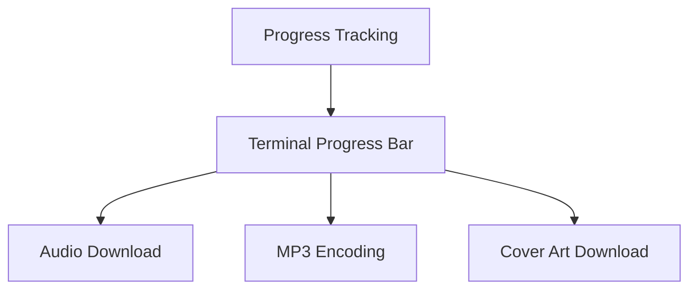
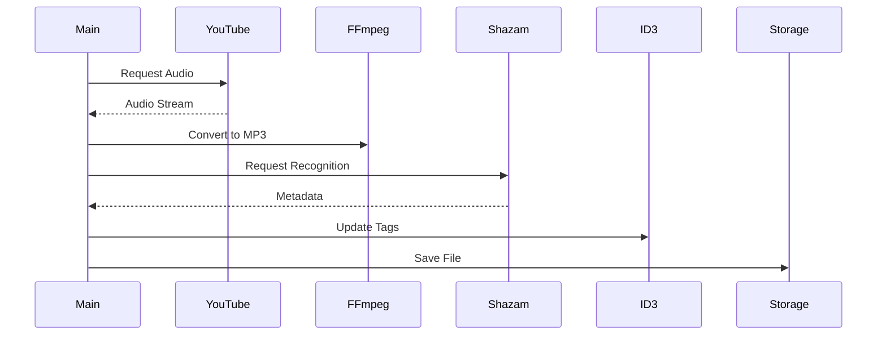
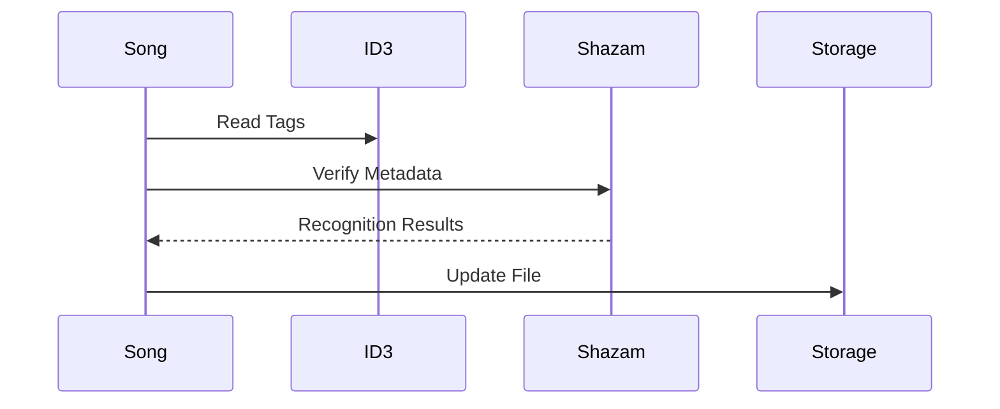

# Core Components

This document details the core components of PYPL2MP3 and their interactions.

## Song Model

The `SongModel` class is the central component for managing song data and operations.

### Key Responsibilities

1. **Audio Processing**
   - YouTube audio stream download
   - MP3 conversion
   - Audio format handling

2. **Metadata Management**
   - ID3 tag handling
   - Cover art management
   - File naming conventions

3. **Song Recognition**
   - Shazam integration
   - Artist/title matching
   - Match score calculation

### Progress Tracking



## Repository Management

The repository system handles:
- Playlist organization
- File system operations
- Storage structure

### Directory Structure
```
repository_root/
├── playlist_id_1/
│   ├── song1.mp3
│   └── song2.mp3
├── playlist_id_2/
│   └── ...
└── pypl2mp3.log
```

## Library Components

### 1. Exception Handling
- Custom exception classes
- Error categorization
- User-friendly messages

### 2. Logging System
- Operation tracking
- Debug information
- Error reporting

### 3. Utility Functions
- String sanitization
- File path handling
- Format conversion

## Data Flow

### Song Import Process


### Metadata Management


## Component Interfaces

### 1. Song Model Interface
```python
class SongModel:
    - Audio download management
    - Metadata handling
    - File operations
    - Tag management
```

### 2. Progress Tracking Interface
```python
class ProgressBarInterface:
    - Download progress
    - Conversion status
    - Operation feedback
```

### 3. Repository Interface
```python
class Repository:
    - Playlist management
    - File organization
    - Storage handling
```

## Event System

1. **Progress Events**
   - Download progress
   - Conversion status
   - Operation completion

2. **Error Events**
   - Network failures
   - Conversion issues
   - Storage problems

## Configuration Management

1. **Environment Variables**
   - Repository path
   - Default playlist
   - Debug settings

2. **Runtime Settings**
   - Match thresholds
   - Operation modes
   - Verbosity levels

## Resource Management

### 1. Temporary Files
- Download buffers
- Conversion workspace
- Cover art cache

### 2. Network Resources
- YouTube connections
- Shazam API calls
- Cover art downloads

### 3. Storage Management
- File cleanup
- Space monitoring
- Cache handling

## Integration Points

1. **External Services**
   - YouTube API integration
   - Shazam recognition
   - File system access

2. **Internal Systems**
   - Command processing
   - Progress tracking
   - Error handling