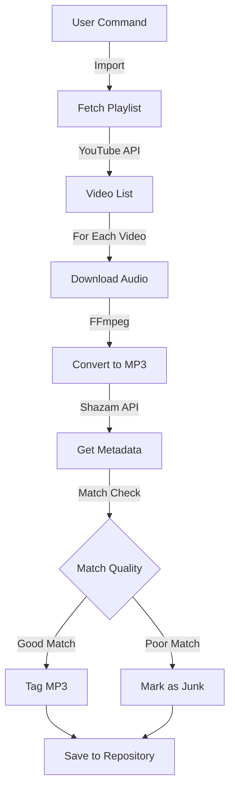
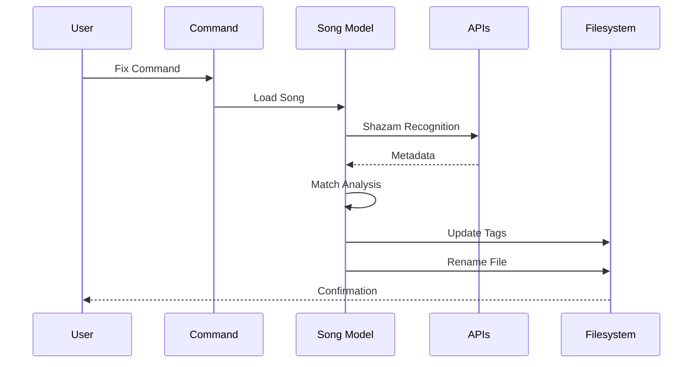
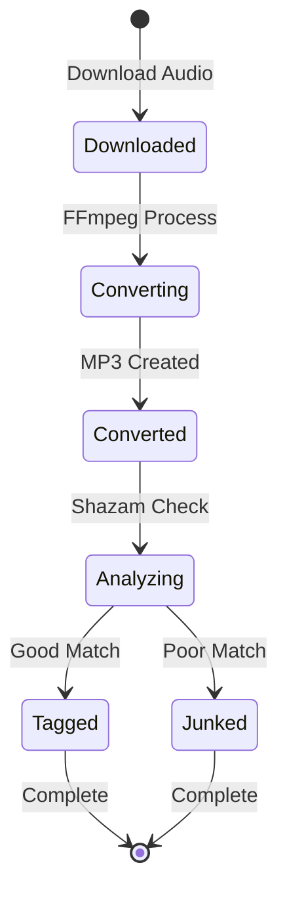
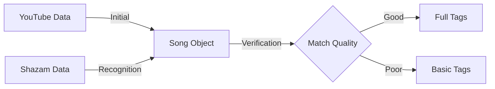
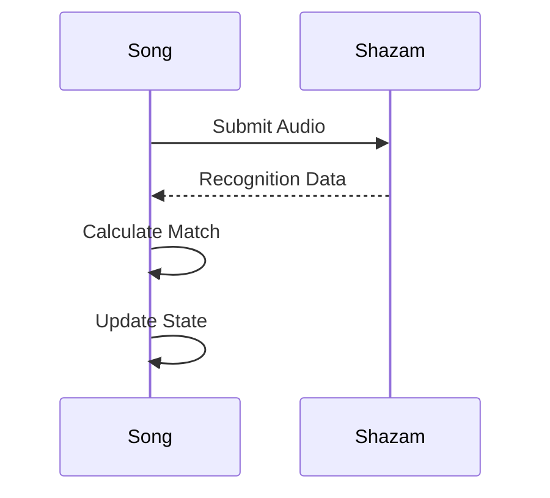
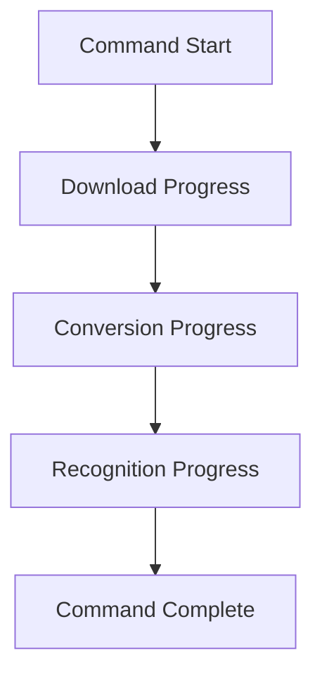
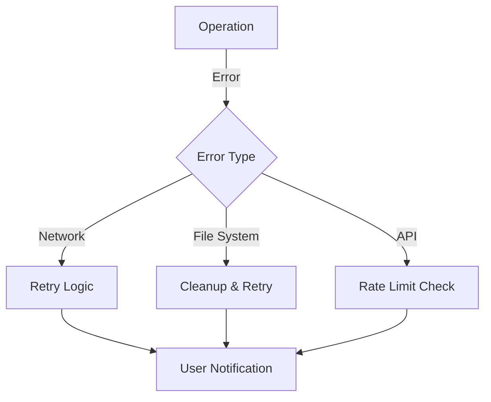
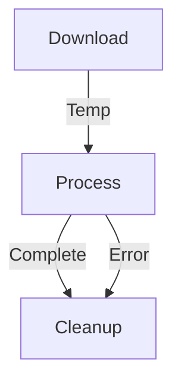
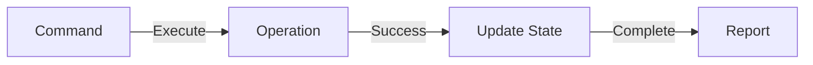

# Data Flow Documentation

This document details how data flows through the PYPL2MP3 system, including file operations, API interactions, and state transformations.

## Main Data Flows

### 1. Playlist Import Flow



### 2. Metadata Processing



## File Operations

### 1. Song Creation Path
```
YouTube Video
  ↓
Audio Stream (m4a)
  ↓
Temporary Storage
  ↓
FFmpeg Conversion
  ↓
MP3 with ID3 Tags
  ↓
Final Repository
```

### 2. File Naming Convention
```
Regular: ARTIST - TITLE [VIDEO_ID].mp3
Junk:   ARTIST - TITLE [VIDEO_ID] (JUNK).mp3
```

## State Management

### 1. Song State Transitions


### 2. Metadata Flow


## API Interactions

### 1. YouTube Integration
- Playlist information retrieval
- Video metadata fetching
- Audio stream download
- Rate limiting compliance

### 2. Shazam Integration


## Progress Tracking

### 1. Operation Progress


### 2. Progress Reporting
```
Download:  [■■■■■■····] 60%
Convert:   [■■■■■■■■··] 80%
Recognize: [■■■■■■■■■■] 100%
```

## Error Handling Flow



## Data Storage

### 1. Repository Structure
```
repository/
├── playlist_id/
│   ├── metadata/
│   │   └── playlist_info.json
│   └── songs/
│       ├── song1.mp3
│       └── song2.mp3
└── logs/
    └── pypl2mp3.log
```

### 2. Metadata Storage
- ID3v2.3 tags
- Custom TXXX fields
- Cover art embedding

## Cache Management

### 1. Temporary Storage


### 2. Resource Cleanup
- Automatic temporary file removal
- Failed download cleanup
- Incomplete conversion cleanup

## Command Results

### 1. Success Path


### 2. Failure Path
```mermaid
graph LR
    A[Command] -->|Execute| B[Operation]
    B -->|Fail| C[Error Handler]
    C -->|Retry| B
    C -->|Give Up| D[Error Report]