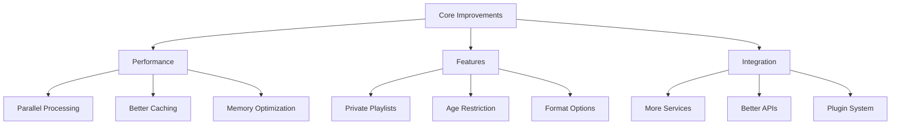
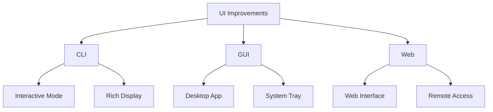

# Future Improvements

This document outlines potential enhancements and future development plans for PYPL2MP3.

## Feature Enhancements

### 1. Core Functionality

#### Performance Optimization
- Parallel download support
- Improved caching system
- Memory usage optimization
- Batch processing capabilities

#### Feature Expansion
- Private playlist support
- Age-restricted content handling
- Multiple format support
- Advanced search capabilities

#### Integration Enhancement
- Additional music services
- Alternative recognition services
- Plugin system support

### 2. User Interface

#### CLI Enhancements
- Interactive mode improvements
- Rich terminal display
- Progress visualization
- Color scheme customization

#### GUI Development
- Desktop application
- System tray integration
- Playlist visualization
- Drag-and-drop support

#### Web Interface
- Browser-based management
- Remote access capabilities
- Mobile-friendly design

## Technical Improvements

### 1. Architecture

#### Code Structure
- Modular design enhancement
- Better separation of concerns
- Improved error handling
- Enhanced testing coverage

#### System Design
- Microservices architecture
- Event-driven processing
- Better state management
- Enhanced concurrency

### 2. Performance

#### Processing
- Multi-threading support
- Asynchronous operations
- Resource optimization
- Load balancing

#### Storage
- Improved file organization
- Better cache management
- Database integration
- Backup solutions

## User Experience

### 1. Workflow Improvements

#### Playlist Management
- Bulk operations
- Smart playlists
- Auto-organization
- Duplicate detection

#### Content Discovery
- Enhanced search
- Recommendations
- Similar content
- Related videos

### 2. Configuration

#### Settings Management
- Profile support
- Configuration UI
- Import/export settings
- Preset management

## Integration Plans

### 1. External Services

#### Music Services
- Spotify integration
- SoundCloud support
- Local library sync
- Cross-platform sync

#### Recognition Services
- Multiple providers
- Better accuracy
- Offline recognition
- Custom matching

### 2. System Integration

#### OS Integration
- File associations
- Context menu
- Quick actions
- Notifications

#### Media Players
- VLC integration
- Media center support
- Remote control
- Streaming support

## Development Roadmap

### Phase 1: Foundation
1. Core optimization
2. Performance improvements
3. Error handling enhancement
4. Testing framework

### Phase 2: Features
1. New format support
2. Enhanced recognition
3. Batch processing
4. Advanced search

### Phase 3: Interface
1. GUI development
2. Web interface
3. Mobile support
4. Remote access

## Implementation Priorities

### High Priority
1. Performance optimization
2. Error handling
3. Core features
4. Stability improvements

### Medium Priority
1. UI enhancements
2. Additional formats
3. Integration options
4. Search capabilities

### Long-term Goals
1. Cross-platform GUI
2. Service integration
3. Cloud support
4. Mobile apps

## Community Feedback

### Requested Features
1. Playlist sharing
2. Social features
3. Recommendation system
4. Custom formats

### User Experience
1. Simplified workflow
2. Better feedback
3. More automation
4. Enhanced control

## Technical Debt

### Code Quality
1. Refactoring needs
2. Documentation updates
3. Test coverage
4. Architecture improvements

### Infrastructure
1. Build system
2. Deployment process
3. Monitoring
4. Scalability

## Research Areas

### 1. Technology
- New audio formats
- Recognition algorithms
- Processing optimization
- Storage solutions

### 2. Integration
- API developments
- Service connectivity
- Protocol support
- Security measures

## Documentation Plans

### 1. Technical Docs
- API documentation
- Architecture guides
- Integration guides
- Development setup

### 2. User Docs
- Advanced tutorials
- Use case examples
- Troubleshooting
- Best practices

## Testing Strategy

### 1. Coverage
- Unit tests
- Integration tests
- Performance tests
- User acceptance

### 2. Automation
- CI/CD pipeline
- Automated testing
- Release process
- Quality checks