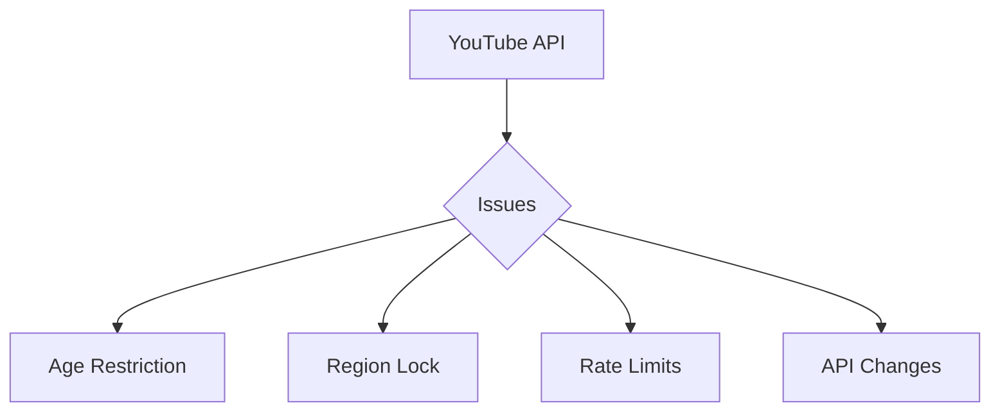
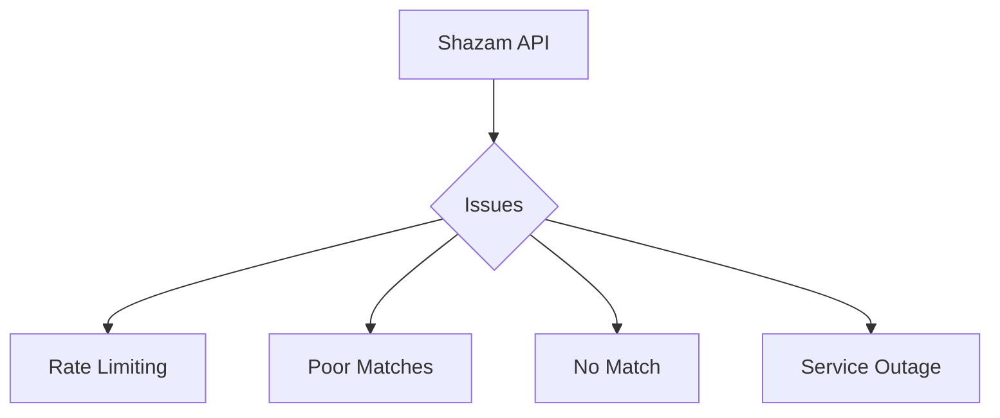
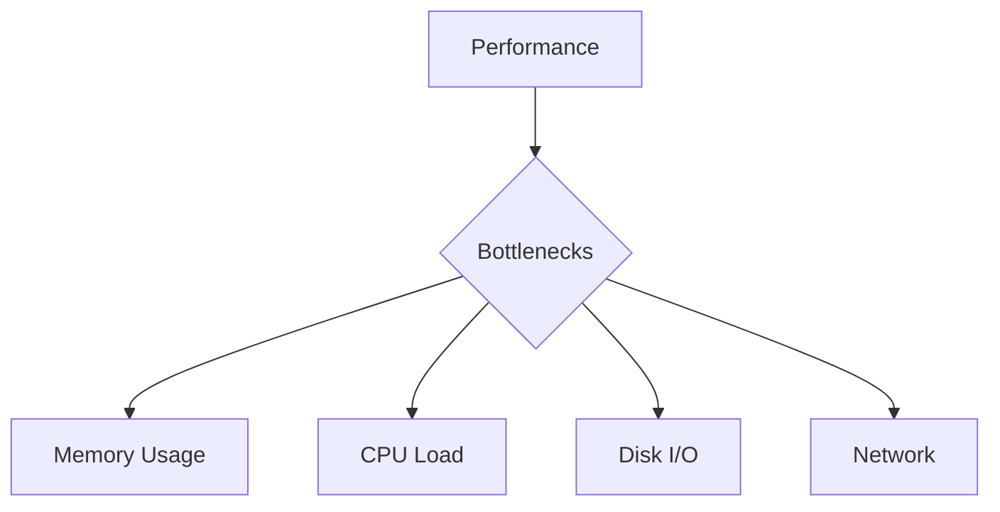

# Known Issues

This document tracks current limitations, bugs, and known issues in PYPL2MP3.

## API Integration Issues

### 1. YouTube Access


#### Symptoms
- Failed video downloads
- Access denied errors
- Timeout issues

#### Impact
- Cannot download age-restricted videos
- Region-locked content inaccessible
- Temporary download failures

### 2. Shazam Recognition


#### Symptoms
- Low match scores
- Recognition failures
- Service timeouts

#### Impact
- Incorrect metadata
- Untagged files
- Processing delays

## File System Issues

### 1. Storage Management
- Large playlist handling
- Temporary file cleanup
- Space requirements

### 2. File Access
- Permission errors
- Lock conflicts
- Path length limits

### 3. File Naming
- Special character handling
- Duplicate names
- Unicode support

## Performance Issues

### 1. Resource Usage


#### High Memory Usage
- Large playlist processing
- Audio conversion
- Multiple operations

#### Processing Speed
- Long conversion times
- Slow metadata updates
- Batch operation delays

## Metadata Management

### 1. Tag Handling
- Inconsistent metadata
- Missing information
- Tag corruption

### 2. Cover Art
- Download failures
- Image quality
- Format compatibility

### 3. Recognition
- False matches
- Low confidence scores
- Missing matches

## Current Limitations

### 1. Content Access
- Public playlists only
- No private video support
- Platform restrictions

### 2. Processing
- Sequential downloads
- Single thread operations
- Rate limit adherence

### 3. Customization
- Fixed audio format
- Limited tag fields
- Preset thresholds

## Error Conditions

### 1. Network Related
```
ERROR: Failed to stream audio track
CAUSE: Network connectivity or API restrictions
```

### 2. File System
```
ERROR: Failed to save MP3 file
CAUSE: Permissions or space issues
```

### 3. Recognition
```
ERROR: Shazam API seems out of service
CAUSE: Rate limiting or service issues
```

## Impact Levels

### Critical
1. Download failures
2. File corruption
3. Data loss

### High
1. Recognition errors
2. Metadata issues
3. Performance degradation

### Medium
1. UI glitches
2. Minor delays
3. Non-critical failures

## Current Status

### Active Issues
1. Age-restricted content blocking
2. Rate limit impacts
3. Large playlist performance

### Under Investigation
1. Memory optimization
2. Recognition accuracy
3. Error handling improvements

### Planned Fixes
1. Batch processing
2. Improved caching
3. Better error recovery

## Workaround Status

### Available Workarounds
1. Rate limit delays
2. Manual metadata entry
3. Alternative paths

### No Current Workaround
1. Age restrictions
2. Private content
3. Region locks

## Reporting Guidelines

### Required Information
1. Error message
2. Command used
3. System details
4. Reproduction steps

### Debug Output
```sh
# Enable full debugging
pypl2mp3 -d -D <command>
```

### Log Collection
1. Console output
2. Log file content
3. Error details

## Update Status

### Recent Fixes
- Improved error handling
- Better rate limiting
- Enhanced recovery

### Pending Issues
- Performance optimization
- Memory management
- Recognition accuracy

### Future Improvements
- Parallel processing
- Enhanced caching
- Better error recovery