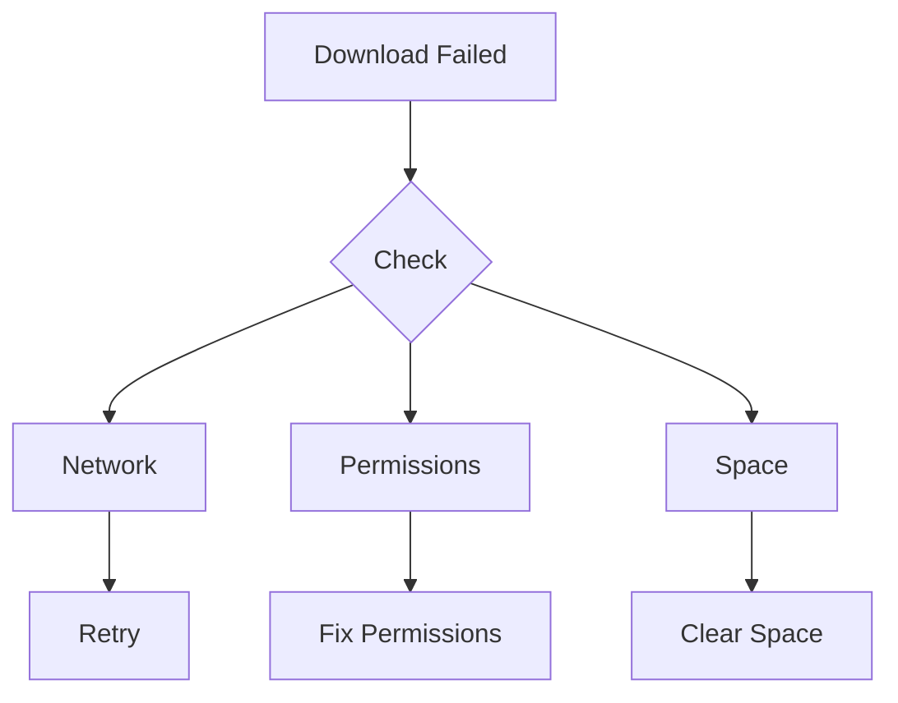
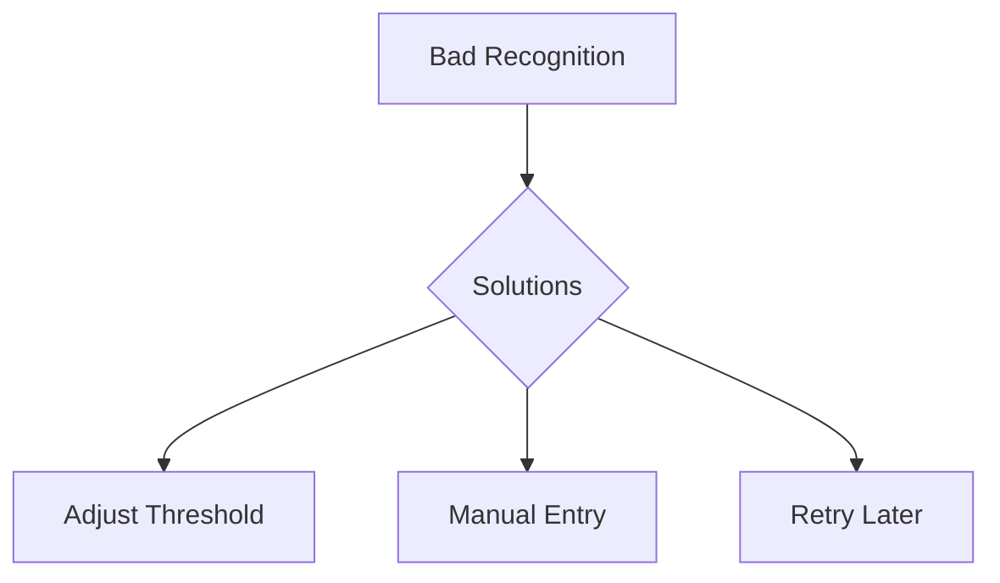

# Solutions & Workarounds

This document provides solutions and workarounds for common issues in PYPL2MP3.

## API-Related Solutions

### YouTube Issues

1. **Rate Limiting**
   ```sh
   # Add delays between operations
   pypl2mp3 import -p  # Use prompt mode
   ```

2. **Access Denied**
   ```sh
   # Update pytubefix
   uv lock --upgrade-package pytubefix
   ```

3. **Region Restrictions**
   - Use VPN service
   - Try alternative video sources
   - Import from accessible regions

### Shazam Recognition

1. **Poor Matches**
   ```sh
   # Adjust threshold
   pypl2mp3 fix -t 40  # More permissive
   pypl2mp3 fix -t 75  # More strict
   ```

2. **Rate Limits**
   ```mermaid
   graph TD
       A[Rate Limit] --> B{Solutions}
       B --> C[Automatic Delay]
       B --> D[Retry Logic]
       B --> E[Manual Entry]
   ```

3. **No Matches**
   - Manual metadata entry
   - Use YouTube metadata
   - Retry with different thresholds

## File System Solutions

### Permission Issues

1. **Repository Access**
   ```sh
   # Fix permissions
   chmod -R u+rw "$PYPL2MP3_DEFAULT_REPOSITORY_PATH"
   ```

2. **Temporary Files**
   ```sh
   # Clear temp files
   rm -rf /tmp/pypl2mp3*
   ```

### Storage Problems

1. **Space Management**
   ```sh
   # Check space
   du -sh "$PYPL2MP3_DEFAULT_REPOSITORY_PATH"/*
   ```

2. **File Organization**
   - Regular cleanup
   - Archive old playlists
   - Remove duplicate songs

## Performance Solutions

### Memory Usage

1. **Large Playlists**
   ```sh
   # Process in smaller chunks
   pypl2mp3 import -f "keyword" <playlist>
   ```

2. **Resource Management**
   - Close unused applications
   - Monitor system resources
   - Schedule large operations

### Processing Speed

1. **Conversion Optimization**
   - Process during off-peak hours
   - Use SSD for temporary storage
   - Minimize concurrent operations

## Metadata Solutions

### Tag Management

1. **Missing Information**
   ```sh
   # Manual fix mode
   pypl2mp3 fix -p
   ```

2. **Incorrect Tags**
   ```sh
   # Reset and retry
   pypl2mp3 junkize
   pypl2mp3 fix -t 70
   ```

### Cover Art

1. **Download Issues**
   - Retry operation
   - Manual art addition
   - Alternative art sources

2. **Quality Problems**
   - Use high-res sources
   - Manual art replacement
   - Quality verification

## Common Problems & Solutions

### 1. Failed Downloads



### 2. Recognition Failures



## Best Practices

### 1. Preventive Measures
- Regular maintenance
- Space monitoring
- Permission checks
- Update dependencies

### 2. Operation Guidelines
- Use appropriate thresholds
- Enable debug for issues
- Regular backups
- Systematic approach

## Quick Fixes

### 1. Command Issues
```sh
# Reset command
CTRL+C

# Clear terminal
clear
```

### 2. File Issues
```sh
# Remove corrupted file
rm "<corrupted_file>"

# Retry operation
pypl2mp3 import -p
```

## Recovery Procedures

### 1. Data Recovery
```sh
# Backup current state
cp -r "$PYPL2MP3_DEFAULT_REPOSITORY_PATH" backup/

# Restore from backup
cp -r backup/* "$PYPL2MP3_DEFAULT_REPOSITORY_PATH"
```

### 2. Operation Recovery
```sh
# Clean start
pypl2mp3 -d import  # With debug
```

## Maintenance Solutions

### 1. Regular Maintenance
```sh
# Update dependencies
uv lock --upgrade

# Clear logs
truncate -s 0 "$PYPL2MP3_DEFAULT_REPOSITORY_PATH/pypl2mp3.log"
```

### 2. System Health
```sh
# Check dependencies
ffmpeg -version
node --version
python --version
```

## Advanced Solutions

### 1. Custom Scripts
```sh
# Batch processing
for playlist in $(pypl2mp3 playlists); do
    pypl2mp3 fix -l "$playlist"
done
```

### 2. Integration
```sh
# Shell aliases
alias yt2mp3='pypl2mp3 import'
alias ytfix='pypl2mp3 fix -p'
```

## Emergency Procedures

### 1. Critical Failures
1. Stop current operation
2. Enable full debug
3. Check logs
4. Verify file system
5. Attempt recovery

### 2. Data Issues
1. Backup data
2. Verify integrity
3. Fix permissions
4. Retry operations