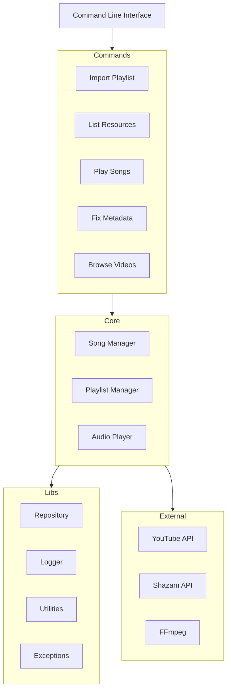
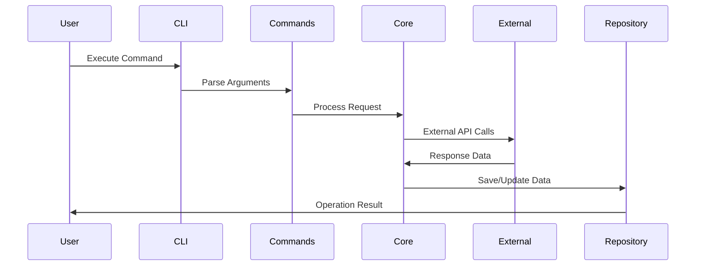
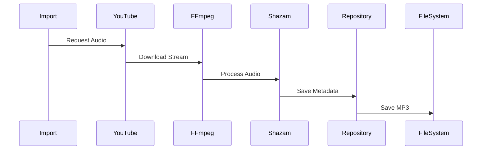

# System Architecture

This document outlines the architectural design of PYPL2MP3, including its components, relationships, and data flow.

## High-Level Architecture



## Component Structure

### 1. Command Layer
- Location: `src/pypl2mp3/commands/`
- Purpose: Command-line interface implementation
- Key Components:
  - `import_playlist.py`: Playlist import functionality
  - `browse_videos.py`: Video browsing and interaction
  - `fix_junks.py`: Metadata correction
  - `play_songs.py`: Audio playback interface
  - Various list commands for resource management

### 2. Core Components
- Location: `src/pypl2mp3/libs/`
- Key Components:
  - `song.py`: Song model and metadata management
  - `repository.py`: File system interaction and storage
  - `utils.py`: Shared utilities and helpers
  - `exceptions.py`: Custom exception handling
  - `logger.py`: Logging and debug support

### 3. External Integrations
- YouTube: Video and playlist data retrieval
- Shazam: Song recognition and metadata
- FFmpeg: Audio processing and conversion

## Data Flow

1. **Command Processing**


2. **Audio Processing**


## Key Design Patterns

1. **Command Pattern**
   - Encapsulated command execution
   - Consistent interface structure
   - Modular command implementation

2. **Repository Pattern**
   - Centralized data access
   - File system abstraction
   - Consistent storage interface

3. **Factory Pattern**
   - Dynamic command instantiation
   - Flexible object creation
   - Runtime configuration

4. **Observer Pattern**
   - Event-driven audio player
   - Progress tracking
   - User feedback

## File Organization

```
src/pypl2mp3/
├── __init__.py
├── main.py
├── commands/
│   ├── import_playlist.py
│   ├── fix_junks.py
│   ├── play_songs.py
│   └── ...
└── libs/
    ├── repository.py
    ├── song.py
    ├── utils.py
    └── ...
```

## Security Considerations

1. **File System**
   - Sanitized file names
   - Permission checking
   - Safe path handling

2. **External APIs**
   - Error handling
   - Rate limiting
   - Token management

3. **User Input**
   - Input validation
   - Safe argument parsing
   - Error feedback

## Error Handling

- Hierarchical exception system
- Detailed error logging
- User-friendly messages
- Debug mode support